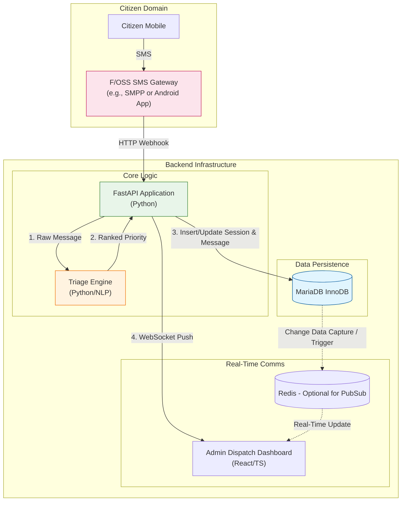

# System Design Document: Text-Based 911 Emergency Dispatch Prototype

---
> WARNING: THIS IS NOT THE FINAL DESIGN, BUT JUST SOME PRELIMINARY AND INITIAL FEEDBACK
---

This document outlines the architecture, data structures, and triage logic for a text-based 911 
emergency dispatch service utilizing a **Python-only backend stack** (FastAPI), **MariaDB** for data persistence, 
and **100% free, open-source infrastructure**.

I highly recommend integrating an LLM taht you can even host on your own computer to enhance the aanalysis. 
You would just as in your FastAPI service interface it with API queries.

I would consider this project as lacking an important feature if you do not use in your final version also an LLM.

## 1. High-Level Architecture Diagram

The following diagram illustrates the data flow from the citizen's mobile device through the 
open-source ingestion components, into the database, and finally to the dispatcher's dashboard.




```mermaid
graph TD
    subgraph Citizen Domain
        User[Citizen Mobile] -->|SMS| Gateway[F/OSS SMS Gateway<br/>(e.g., SMPP or Android App)]
    end

    subgraph Backend Infrastructure
        Gateway -->|HTTP Webhook| API[FastAPI Application<br/>(Python)]
        
        subgraph Core Logic
            API -->|1. Raw Message| Triage[Triage Engine<br/>(Python/NLP)]
            Triage -->|2. Ranked Priority| API
        end

        subgraph Data Persistence
            API -->|3. Insert/Update Session & Message| DB[(MariaDB InnoDB)]
        end

        subgraph Real-Time Comms
            DB -.->|Change Data Capture / Trigger| Redis[(Redis - Optional for PubSub)]
            API -->|4. WebSocket Push| Dashboard[Admin Dispatch Dashboard<br/>(React/TS)]
            Redis -.->|Real-Time Update| Dashboard
        end
    end

    style DB fill:#e1f5fe,stroke:#01579b
    style API fill:#e8f5e9,stroke:#2e7d32
    style Triage fill:#fff3e0,stroke:#ef6c00
    style Gateway fill:#fce4ec,stroke:#c2185b

```

### Architecture Component Description

1. Not yet sure if this is needed, we can simulate with a mock service, which actually may be better: **F/OSS SMS Gateway:** Replaces paid commercial APIs. This could be a self-hosted Kannel server connected to a cellular modem (SMPP) or an open-source Android application that forwards received SMS messages via HTTP POST to the API layer.
2. **FastAPI Application:** The central integration point. It handles HTTP requests from the gateway, invokes the Triage Engine, manages database transactions, and pushes real-time updates to the dashboard via WebSockets.
3. **Triage Engine:** A distinct Python module that performs keyword analysis on message bodies to calculate priority scores (see Section 3).
4. **MariaDB (InnoDB):** The source of truth. It stores session state, full message logs, and dispatcher activity logs with full ACID compliance.
5. **Admin Dispatch Dashboard:** A React-based single-page application that provides dispatchers with a live view of incoming emergencies, sorted by priority.

---

## 2. MariaDB Database Schema

The database uses sample (incomplete) tables configured for transactional integrity, automatic timestamp updates, and performance indexing to instantly surface high-priority emergencies.

```sql
-- Active Emergency Sessions / Threads
CREATE TABLE emergency_sessions (
    session_id INT AUTO_INCREMENT PRIMARY KEY,
    phone_number VARCHAR(20) NOT NULL,
    current_status VARCHAR(50) DEFAULT 'QUEUED', -- QUEUED, DISPATCHED, RESOLVED
    assigned_dispatcher_id INT NULL,
    created_at TIMESTAMP DEFAULT CURRENT_TIMESTAMP,
    updated_at TIMESTAMP DEFAULT CURRENT_TIMESTAMP ON UPDATE CURRENT_TIMESTAMP
);

-- Individual Text Messages
CREATE TABLE messages (
    message_id INT AUTO_INCREMENT PRIMARY KEY,
    session_id INT,
    sender_type ENUM('CITIZEN', 'DISPATCHER', 'SYSTEM') NOT NULL,
    body TEXT NOT NULL,
    priority_score FLOAT DEFAULT 0.0,
    priority_tier TINYINT CHECK (priority_tier BETWEEN 1 AND 3),
    classification_label VARCHAR(20),
    received_at TIMESTAMP DEFAULT CURRENT_TIMESTAMP,
    FOREIGN KEY (session_id) REFERENCES emergency_sessions(session_id) ON DELETE CASCADE
);

-- Indexing for real-time dashboard sorting performance
CREATE INDEX idx_messages_priority ON messages (priority_tier ASC, received_at DESC);
CREATE INDEX idx_sessions_status ON emergency_sessions (current_status);

```

---

## 3. Python Priority Ranking & Triage Engine

The triage engine analyzes incoming text content to assign a priority tier 
(`1` for Critical, `2` for Urgent, `3` for Routine), protecting against false positives by accounting for simple negations.

```python
import re
from typing import Tuple

# Weighted keyword dictionary mapping emergency terms to severity scores
KEYWORD_WEIGHTS = {
    # Critical Life Safety (Priority 1)
    "gun": 50, "shot": 50, "shooting": 50, "stab": 50, "bleeding": 45,
    "unconscious": 45, "not breathing": 50, "cpr": 50, "fire": 45,
    "choking": 45, "suicide": 50, "overdose": 45, "knife": 45,
    
    # Urgent Safety / Property (Priority 2)
    "robbery": 30, "break-in": 30, "intruder": 35, "car accident": 30,
    "crash": 30, "fight": 25, "harassment": 20,
    
    # Non-Urgent / Routine (Priority 3)
    "noise": 5, "theft": 10, "lost": 5, "property": 5
}

NEGATION_TERMS = {"no", "not", "isn't", "wasn't", "never", "no longer"}

def calculate_priority(text: str) -> Tuple[int, str, float]:
    """
    Scans text message for weighted keywords, checks for immediate negation context,
    and returns a priority tier, label, and cumulative score.
    """
    cleaned_text = text.lower()
    words = re.findall(r'\b\w+\b', cleaned_text)
    
    score = 0.0
    matched_triggers = []

    for i, word in enumerate(words):
        if word in KEYWORD_WEIGHTS:
            # Check context window for negation (e.g., "no weapon")
            context_window = words[max(0, i-2):i]
            is_negated = any(neg in context_window for neg in NEGATION_TERMS)
            
            if is_negated:
                score += (KEYWORD_WEIGHTS[word] * 0.1)
                matched_triggers.append(f"{word} (negated)")
            else:
                score += KEYWORD_WEIGHTS[word]
                matched_triggers.append(word)

    # Map cumulative score to Priority Tiers
    if score >= 40:
        priority_tier = 1
        label = "CRITICAL"
    elif score >= 20:
        priority_tier = 2
        label = "URGENT"
    else:
        priority_tier = 3
        label = "ROUTINE"

    return priority_tier, label, score

```

---

## 4. Operational & Security Best Practices

1. **Data Protection & Compliance:** Text logs containing Personally Identifiable Information (PII) must be encrypted both in transit (TLS 1.3) and at rest within MariaDB storage. Access logs should be maintained for auditing.
2. **Idempotency Handling:** Self-hosted message ingestion gateways can occasionally retry packets due to local network instability. The FastAPI ingestion layer should track unique message identifiers provided by the gateway (e.g., `smpp_message_id`) to prevent duplicate entry generation in MariaDB.
3. **Automated Response Trigger:** Upon receiving a citizen text, the system must immediately reply via the SMS gateway: *"911 Received. Help is being routed. If you are in immediate danger and can speak, please call 911 directly."*
4. **Real-Time Dispatch Feed:** The MariaDB indexes (`idx_messages_priority`) ensure that the admin dashboard can instantly query and display incoming queues sorted by highest severity first.
